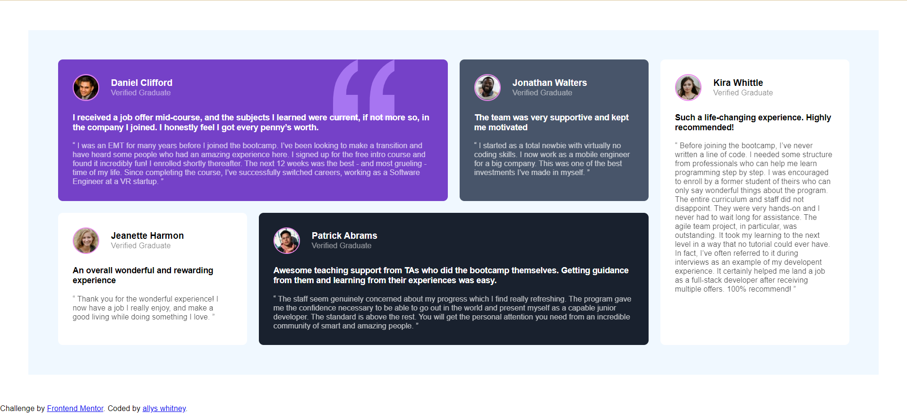

# Frontend Mentor - Testimonials grid section solution

This is a solution to the [Testimonials grid section challenge on Frontend Mentor](https://www.frontendmentor.io/challenges/testimonials-grid-section-Nnw6J7Un7). Frontend Mentor challenges help you improve your coding skills by building realistic projects. 

## Table of contents

- [Overview](#overview)
  - [The challenge](#the-challenge)
  - [Screenshot](#screenshot)
  - [Links](#links)
- [My process](#my-process)
  - [Built with](#built-with)
  - [What I learned](#what-i-learned)
  - [Continued development](#continued-development)
- [Author](#author)
- [Acknowledgments](#acknowledgments)

## Overview

### The challenge

Users should be able to:

- View the optimal layout for the site depending on their device's screen size

### Screenshot
<!--  -->

### Links

- Solution URL: [Add solution URL here](https://your-solution-url.com)
- Live Site URL: [Add live site URL here](https://your-live-site-url.com)

## My process

### Built with

- Semantic HTML5 markup
- CSS custom properties
- CSS Grid

### What I learned

This project is the beginning of my learnings of frontend development,starting with HTML & CSS Layout. From this project I learned CSS Grid layout. Through this project I also learnt about Media Responsiveness.

### Continued development
For future projects I want to continue focusing on the areas outlined below. These are concepts that I am still not comfortable with and also techniques that I found useful in the creation of this project.

## Author

- Website - [Add your name here](https://www.your-site.com)
- Frontend Mentor - [@yourusername](https://www.frontendmentor.io/profile/yourusername)

## Acknowledgments

I would like to acknowledge [Brad Traversy](https://codepen.io/bradtraversy)
[Ingressive4Good](https://ingressive.org/) [Zuri Team](https://zuri.team/) [Zuri Team Training](https://training.zuri.team/)
# about
